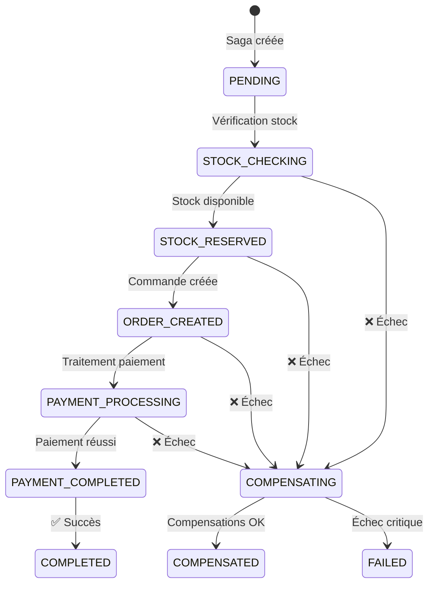

# Système Multi-Magasins - Architecture Microservices - LOG430

[](https://docker.com)
[](https://fastapi.tiangolo.com)
[](https://konghq.com)
[](https://postgresql.org)
[](https://redis.io)

Architecture microservices complète pour la gestion multi-magasins avec API Gateway Kong, load balancing, monitoring et haute disponibilité.

## Table des Matières

- [Vue d'Ensemble](#vue-densemble)
- [Architecture Microservices](#architecture-microservices)
- [Évolution du Projet](#évolution-du-projet)
- [Microservices](#microservices)
- [Kong API Gateway](#kong-api-gateway)
- [Saga Orchestrée - Transactions Distribuées](#saga-orchestrée---transactions-distribuées)
- [Load Balancing et Haute Disponibilité](#load-balancing-et-haute-disponibilité)
- [Monitoring et Métriques](#monitoring-et-métriques)
- [Documentation](#documentation)
- [Déploiement](#déploiement)
- [Tests de Performance](#tests-de-performance)
- [Installation et Configuration](#installation-et-configuration)
- [Utilisation](#utilisation)
- [Technologies Utilisées](#technologies-utilisées)

## Vue d'Ensemble

Système complet de gestion multi-magasins évoluant d'une architecture monolithique vers une architecture microservices haute performance avec API Gateway Kong.

### Objectifs de Performance
- **Charge** : 100+ utilisateurs simultanés
- **Latence** : p95 < 105ms
- **Disponibilité** : 99.9% uptime
- **Scalabilité** : Horizontale avec Kong Gateway

### Fonctionnalités Principales
- **5 Microservices** : Inventory, Ecommerce, Retail, Reporting, Saga Orchestrator
- **Saga Orchestrée** : Gestion des transactions distribuées
- **API Gateway** : Kong avec load balancing intelligent
- **Interface Web** : Application Flask responsive
- **Monitoring** : Prometheus + Grafana avec dashboards saga
- **Cache distribué** : Redis avec stratégies TTL
- **Logs centralisés** : Kong Gateway + structured logging

## Architecture Microservices

### Vue d'Ensemble de l'Architecture

```
┌─────────────────────────────────────────────────────────────────────────┐
│                    ARCHITECTURE MICROSERVICES                           │
├─────────────────┬─────────────────┬─────────────────┬───────────────────┤
│   API GATEWAY   │   MICROSERVICES │   DONNÉES       │   MONITORING      │
│                 │                 │                 │                   │
│ • Kong Gateway  │ • Inventory API │ • PostgreSQL    │ • Prometheus      │
│ • Load Balancer │ • Ecommerce API │ • Redis Cache   │ • Grafana         │
│ • Rate Limiting │ • Retail API    │ • Logs Files    │ • Alerting        │
│ • Auth/Keys     │ • Reporting API │ • Volumes       │ • Dashboards      │
│ • Logging       │ • Auto Scale    │ • Clustering    │ • Metrics         │
│ • Port 8000     │ • Ports 8001-4  │ • Port 5432     │ • Port 3000       │
└─────────────────┴─────────────────┴─────────────────┴───────────────────┘
         ↑                   ↑               ↑               ↑
    Client Requests     Domain Services  Persistent Data   Observability
      (HTTP/HTTPS)      (Independent)    (Shared/Isolated)  (Real-time)
```

### Microservices Domain Map

```
┌─────────────────────────────────────────────────────────────────────────────────────┐
│                               DOMAINES MÉTIER                                       │
├─────────────┬─────────────┬─────────────┬─────────────┬───────────────────────────┤
│ INVENTORY   │ ECOMMERCE   │   RETAIL    │ REPORTING   │    SAGA ORCHESTRATOR      │
│             │             │             │             │                           │
│ • Products  │ • Customers │ • Stores    │ • Analytics │ • Transaction Coord.      │
│ • Categories│ • Orders    │ • Cash Reg. │ • KPIs      │ • Distributed Saga        │
│ • Stock     │ • Carts     │ • Sales     │ • Dashboard │ • Compensation Logic      │
│ • Suppliers │ • Payments  │ • Returns   │ • Trends    │ • State Management        │
│ • Warehouse │ • Shipping  │ • Inventory │ • Forecast  │ • Service Orchestration   │
│             │             │             │             │                           │
│ Port: 8001  │ Port: 8002  │ Port: 8003  │ Port: 8004  │ Port: 8005                │
│ DB: inv     │ DB: ecom    │ DB: retail  │ DB: report  │ DB: saga_orchestrator     │
└─────────────┴─────────────┴─────────────┴─────────────┴───────────────────────────┘
      ↑              ↑            ↑            ↑                    ↑
Product Catalog  Customer Journey POS Ops  Business Intel  Distributed Transactions
```

## Évolution du Projet

### Phase 1 - Lab 3 : Architecture Monolithique
- **Flask Web App** : Interface utilisateur complète
- **FastAPI** : API RESTful avec DDD
- **PostgreSQL** : Base de données partagée
- **Docker** : Containerisation de base

### Phase 2 - Lab 4 : Load Balancing et Cache
- **Nginx Load Balancer** : Distribution de charge
- **Redis Cache** : Optimisation des performances
- **Multiple Instances** : Scalabilité horizontale
- **Monitoring** : Métriques de base

### Phase 3 - Lab 5 : Microservices avec Kong Gateway
- **Kong Gateway** : API Gateway centralisé
- **4 Microservices** : Séparation par domaine
- **Prometheus + Grafana** : Monitoring avancé
- **Logging centralisé** : Traçabilité complète
- **API Key Management** : Sécurité et rate limiting

### Phase 4 - Lab 6 : Saga Orchestrée et Observabilité
- **Saga Orchestrator** : Gestion des transactions distribuées
- **Pattern Saga Orchestrée** : Cohérence des données inter-services
- **Mécanismes de Compensation** : Annulation automatique en cas d'échec
- **Observabilité Avancée** : Monitoring et métriques saga
- **Validation RESTful** : APIs conformes aux standards

## Microservices

### 1. Inventory API (Port 8001)
**Domaine** : Gestion des produits et stocks
```yaml
Endpoints:
  - GET /api/v1/products
  - GET /api/v1/categories
  - GET /api/v1/stock
  - POST /api/v1/products
  - PUT /api/v1/stock/{product_id}

Responsabilités:
  - Catalogue produits
  - Gestion des catégories
  - Niveaux de stock
  - Réapprovisionnement
```

### 2. Ecommerce API (Port 8002)
**Domaine** : Gestion des clients et commandes
```yaml
Endpoints:
  - GET /api/v1/customers
  - GET /api/v1/orders
  - GET /api/v1/carts
  - POST /api/v1/orders
  - PUT /api/v1/carts/{cart_id}

Responsabilités:
  - Gestion clients
  - Commandes en ligne
  - Paniers d'achats
  - Processus de paiement
```

### 3. Retail API (Port 8003)
**Domaine** : Gestion des magasins et ventes
```yaml
Endpoints:
  - GET /api/v1/stores
  - GET /api/v1/cash-registers
  - GET /api/v1/sales
  - POST /api/v1/sales
  - POST /api/v1/returns

Responsabilités:
  - Gestion magasins
  - Caisses enregistreuses
  - Transactions de vente
  - Retours produits
```

### 4. Reporting API (Port 8004)
**Domaine** : Rapports et analytics
```yaml
Endpoints:
  - GET /api/v1/reports/sales
  - GET /api/v1/reports/inventory
  - GET /api/v1/reports/performance
  - GET /api/v1/analytics/trends
  - GET /api/v1/dashboards

Responsabilités:
  - Rapports métier
  - Analyses de performance
  - Tableaux de bord
  - Prévisions
```

### 5. Saga Orchestrator API (Port 8005)
**Domaine** : Coordination des transactions distribuées
```yaml
Endpoints:
  - POST /api/v1/customers/{customer_id}/order-processing
  - GET /api/v1/sagas/{saga_id}
  - GET /api/v1/sagas
  - GET /api/v1/health
  - GET /metrics

Responsabilités:
  - Orchestration des sagas
  - Gestion des compensations
  - Cohérence des transactions
  - Monitoring des processus métier
  - États et historique des sagas
```

## Kong API Gateway

### Configuration Load Balancée

Kong Gateway distribue intelligemment le trafic entre les instances des microservices avec load balancing avancé.

```yaml
# kong/kong-loadbalanced.yml
_format_version: "3.0"
_transform: true

services:
  - name: inventory-service
    url: http://inventory-1:8001
    tags: ["inventory"]
    routes:
      - name: inventory-route
        paths: ["/api/v1/products", "/api/v1/categories", "/api/v1/stock"]
        
  - name: ecommerce-service
    url: http://ecommerce-1:8002
    tags: ["ecommerce"]
    routes:
      - name: ecommerce-route
        paths: ["/api/v1/customers", "/api/v1/orders", "/api/v1/carts"]

upstreams:
  - name: inventory-upstream
    targets:
      - target: inventory-1:8001
        weight: 100
      - target: inventory-2:8001
        weight: 100
    healthchecks:
      active:
        http_path: "/health"
        healthy:
          interval: 30
          successes: 2
        unhealthy:
          interval: 10
          http_failures: 3
```

## Saga Orchestrée - Transactions Distribuées

### Architecture Saga

Le système implémente le **pattern Saga Orchestrée** pour maintenir la cohérence des données dans les transactions distribuées qui impliquent plusieurs microservices.

```
┌─────────────────────────────────────────────────────────────────────────┐
│                    SAGA ORCHESTRATION PATTERN                           │
├─────────────────┬─────────────────┬─────────────────┬───────────────────┤
│ ORCHESTRATEUR   │   PARTICIPANTS  │   COMPENSATIONS │   OBSERVABILITÉ   │
│                 │                 │                 │                   │
│ • Central       │ • Inventory API │ • Release Stock │ • État Temps Réel │
│ • Stateful      │ • Ecommerce API │ • Cancel Order  │ • Métriques       │
│ • Sequential    │ • Sync Calls    │ • Refund Pay    │ • Dashboards      │
│ • Compensate    │ • Independent   │ • Automatic     │ • Logs Saga       │
│ • Monitor       │ • RESTful       │ • Reversible    │ • Alerting        │
│                 │                 │                 │                   │
│ Port: 8005      │ Ports: 8001-2   │ Inverse Order   │ Port: 3000        │
└─────────────────┴─────────────────┴─────────────────┴───────────────────┘
         ↑                   ↑               ↑               ↑
   Central Control     Domain Services   Error Recovery   Real-time View
```

### Workflow de Traitement de Commande

#### Étapes de la Saga



#### Scénario de Succès

```yaml
POST /customers/123/order-processing
Payload:
  products:
    - product_id: 1
      quantity: 2
    - product_id: 5
      quantity: 1
  shipping_address: "123 Main St"
  billing_address: "123 Main St"
  payment_method: "credit_card"

Flux d'exécution:
  1. CHECK_STOCK     → ✅ Produits disponibles
  2. RESERVE_STOCK   → ✅ Stock réservé
  3. CREATE_ORDER    → ✅ Commande créée (ID: 456)
  4. PROCESS_PAYMENT → ✅ Paiement traité (ID: 789)
  5. CONFIRM_ORDER   → ✅ Commande confirmée

Résultat: COMPLETED - Transaction réussie
```

#### Scénario d'Échec avec Compensation

```yaml
POST /customers/99999/order-processing
# Customer inexistant

Flux d'exécution:
  1. CHECK_STOCK     → ✅ Produits disponibles
  2. RESERVE_STOCK   → ✅ Stock réservé
  3. CREATE_ORDER    → ❌ Customer 99999 not found

Compensations automatiques:
  1. RELEASE_STOCK   → ✅ Stock libéré

Résultat: COMPENSATED - Système cohérent
```

### Mécanismes de Compensation

#### Mapping Actions ↔ Compensations

| Action Originale | Compensation | Description |
|-----------------|-------------|-------------|
| `CHECK_STOCK` | Aucune | Lecture seule |
| `RESERVE_STOCK` | `RELEASE_STOCK` | Libère le stock réservé |
| `CREATE_ORDER` | `CANCEL_ORDER` | Annule la commande |
| `PROCESS_PAYMENT` | `REFUND_PAYMENT` | Rembourse le paiement |
| `CONFIRM_ORDER` | Aucune | Étape finale |

#### Ordre d'Exécution

Les compensations sont exécutées dans l'**ordre inverse** des étapes réussies, garantissant une restauration cohérente de l'état du système.

### APIs Saga

#### Démarrage de Saga
```bash
# Nouvelle commande pour customer existant
curl -X POST "http://localhost:8000/api/v1/customers/123/order-processing" \
  -H "X-API-Key: admin-key-12345" \
  -H "Content-Type: application/json" \
  -d '{
    "products": [
      {"product_id": 1, "quantity": 2},
      {"product_id": 5, "quantity": 1}
    ],
    "shipping_address": "123 Main St",
    "billing_address": "123 Main St",
    "payment_method": "credit_card"
  }'

# Réponse
{
  "saga_id": "saga_12345",
  "status": "started",
  "message": "Order processing saga started successfully"
}
```

#### Suivi de Saga
```bash
# État d'une saga spécifique
curl -X GET "http://localhost:8000/api/v1/sagas/saga_12345" \
  -H "X-API-Key: admin-key-12345"

# Réponse
{
  "saga_id": "saga_12345",
  "status": "COMPLETED",
  "created_at": "2024-01-15T10:30:00Z",
  "updated_at": "2024-01-15T10:30:45Z",
  "duration": 45.2,
  "steps": [
    {"step": "CHECK_STOCK", "status": "SUCCESS", "duration": 0.1},
    {"step": "RESERVE_STOCK", "status": "SUCCESS", "duration": 0.2},
    {"step": "CREATE_ORDER", "status": "SUCCESS", "duration": 0.3},
    {"step": "PROCESS_PAYMENT", "status": "SUCCESS", "duration": 2.1},
    {"step": "CONFIRM_ORDER", "status": "SUCCESS", "duration": 0.1}
  ]
}
```

#### Liste des Sagas
```bash
# Toutes les sagas récentes
curl -X GET "http://localhost:8000/api/v1/sagas?limit=10" \
  -H "X-API-Key: admin-key-12345"
```

### Observabilité Saga

#### Métriques Prometheus Spécifiques

```yaml
# Compteurs de sagas
saga_orchestrator_sagas_total{status="completed|compensated|failed"}

# Durée des sagas  
saga_orchestrator_saga_duration_seconds

# Étapes détaillées
saga_orchestrator_saga_steps_total{step="CHECK_STOCK|RESERVE_STOCK|...", status="success|failure"}

# Compensations
saga_orchestrator_compensations_total{compensation_type="RELEASE_STOCK|CANCEL_ORDER|..."}

# Participants
saga_orchestrator_service_calls_total{service="inventory|ecommerce", status="success|failure"}
```

#### Dashboard Grafana Saga

Le dashboard de monitoring affiche :
- **Total des Sagas** (complétées/compensées/échouées)
- **Statut en Temps Réel** de la dernière saga
- **Durée Moyenne** par étape
- **Taux de Succès** global
- **Métriques de Compensation** par type
- **Performance des Services** participants

### Avantages de l'Approche

#### Cohérence des Données
- **Atomicité distribuée** : Toutes les étapes réussissent ou sont annulées
- **Isolation** : Chaque saga maintient son propre contexte
- **Durabilité** : État persisté en base PostgreSQL

#### Résilience
- **Compensation automatique** : Annulation des actions en cas d'échec
- **Retry policies** : Gestion des erreurs transitoires  
- **Circuit breaker** : Protection contre les pannes en cascade

#### Observabilité
- **Traçabilité complète** : Historique de chaque étape
- **Monitoring temps réel** : Dashboards et alertes
- **Debugging facilité** : Logs structurés avec contexte complet

### Plugins Kong Configurés

#### 1. Rate Limiting
```yaml
plugins:
  - name: rate-limiting
    config:
      minute: 100
      hour: 1000
      policy: local
      fault_tolerant: true
```

#### 2. Logging
```yaml
plugins:
  - name: file-log
    config:
      path: /var/log/kong/access.log
      reopen: true
```

#### 3. Prometheus Metrics
```yaml
plugins:
  - name: prometheus
    config:
      per_consumer: true
      status_code_metrics: true
      latency_metrics: true
      bandwidth_metrics: true
```

#### 4. Key Authentication
```yaml
plugins:
  - name: key-auth
    config:
      key_names: ["X-API-Key"]
      key_in_body: false
      key_in_header: true
      key_in_query: false
```

### Consumers et API Keys

```yaml
consumers:
  - username: admin-user
    keyauth_credentials:
      - key: "admin-key-12345"
    plugins:
      - name: rate-limiting
        config:
          minute: 1000
          
  - username: frontend-app
    keyauth_credentials:
      - key: "frontend-key-67890"
    plugins:
      - name: rate-limiting
        config:
          minute: 500
```

## Load Balancing et Haute Disponibilité

### Stratégies de Load Balancing

#### 1. Kong Gateway Level
- **Weighted Round Robin** : Distribution intelligente basée sur les poids
- **Health Checks** : Vérification automatique de la santé des instances
- **Circuit Breaker** : Protection contre les défaillances en cascade
- **Failover** : Basculement automatique vers instances saines

#### 2. Service Level
- **Multiple Instances** : 2-3 instances par microservice
- **Auto Scaling** : Ajustement automatique basé sur la charge
- **Resource Limits** : Isolation des ressources par container
- **Graceful Shutdown** : Arrêt propre avec drain des connexions

### Configuration Haute Disponibilité

# docker-compose.kong.yml
version: '3.8'

services:
  kong:
    image: kong:3.4.0
    environment:
      - KONG_DATABASE=off
      - KONG_DECLARATIVE_CONFIG=/kong/declarative/kong.yml
      - KONG_ADMIN_ACCESS_LOG=/dev/stdout
      - KONG_ADMIN_ERROR_LOG=/dev/stderr
      - KONG_ADMIN_LISTEN=0.0.0.0:8001
      - KONG_PROXY_ACCESS_LOG=/dev/stdout
      - KONG_PROXY_ERROR_LOG=/dev/stderr
    deploy:
      replicas: 2
      resources:
        limits:
          memory: 1G
          cpus: '1.0'
        reservations:
          memory: 512M
          cpus: '0.5'
    healthcheck:
      test: ["CMD", "kong", "health"]
      interval: 30s
      timeout: 10s
      retries: 3
      start_period: 40s

  # Microservices avec multiple instances
  inventory-1:
    build: ./services/inventory-api
    environment:
      - INSTANCE_ID=inventory-1
      - DATABASE_URL=postgresql://user:pass@db:5432/inventory
      - REDIS_URL=redis://redis:6379
    deploy:
      resources:
        limits:
          memory: 512M
          cpus: '0.5'
    healthcheck:
      test: ["CMD", "curl", "-f", "http://localhost:8001/health"]
      interval: 30s
      timeout: 10s
      retries: 3

  inventory-2:
    build: ./services/inventory-api
    environment:
      - INSTANCE_ID=inventory-2
      - DATABASE_URL=postgresql://user:pass@db:5432/inventory
      - REDIS_URL=redis://redis:6379
    deploy:
      resources:
        limits:
          memory: 512M
          cpus: '0.5'
    healthcheck:
      test: ["CMD", "curl", "-f", "http://localhost:8001/health"]
      interval: 30s
      timeout: 10s
      retries: 3
```

## Monitoring et Métriques

### Stack de Monitoring

```
┌─────────────────────────────────────────────────────────────────────────┐
│                      MONITORING STACK                                   │
├─────────────────┬─────────────────┬─────────────────┬───────────────────┤
│   COLLECTION    │   STORAGE       │   VISUALIZATION │   ALERTING        │
│                 │                 │                 │                   │
│ • Kong Metrics  │ • Prometheus    │ • Grafana       │ • Alert Manager  │
│ • App Metrics   │ • Time Series   │ • Dashboards    │ • Slack/Email    │
│ • Logs          │ • Retention     │ • Real-time     │ • PagerDuty      │
│ • Health Checks │ • Clustering    │ • Custom Views  │ • Webhooks       │
│ • Custom        │ • Backup        │ • Mobile        │ • Escalation     │
│                 │                 │                 │                   │
│ Port: 9090      │ Port: 9090      │ Port: 3000      │ Port: 9093        │
└─────────────────┴─────────────────┴─────────────────┴───────────────────┘
         ↑                   ↑               ↑               ↑
    Scraping Endpoints   Metrics Storage   User Interface   Notifications
      (Every 15s)        (15 day retention) (Dashboard)    (Critical Events)
```

### Métriques Clés

#### Kong Gateway Metrics
```yaml
# Performances
- kong_request_duration_ms
- kong_request_count
- kong_response_size_bytes
- kong_upstream_latency_ms

# Santé
- kong_upstream_health_checks_total
- kong_upstream_health_check_failures_total
- kong_upstream_target_health

# Trafic
- kong_requests_per_second
- kong_bandwidth_bytes
- kong_rate_limiting_triggered_total
```

#### Application Metrics
```yaml
# FastAPI
- fastapi_requests_total
- fastapi_request_duration_seconds
- fastapi_requests_exceptions_total
- fastapi_requests_processing_time_seconds

# Business
- total_orders_created
- total_products_sold
- inventory_low_stock_alerts
- average_order_value

# Saga Orchestrator
- saga_orchestrator_sagas_total{status="completed|compensated|failed"}
- saga_orchestrator_saga_duration_seconds
- saga_orchestrator_saga_steps_total{step, status}
- saga_orchestrator_compensations_total{compensation_type}
- saga_orchestrator_service_calls_total{service, status}
```

### Dashboards Grafana

#### 1. Kong Gateway Overview
- **Request Rate** : Requêtes par seconde
- **Latency Distribution** : P50, P95, P99
- **Error Rate** : Taux d'erreurs 4xx/5xx
- **Upstream Health** : État des services backend

#### 2. Microservices Performance
- **Response Times** : Temps de réponse par service
- **Throughput** : Débit par endpoint
- **Resource Usage** : CPU, Memory, Network
- **Database Connections** : Pool de connexions

#### 3. Business Metrics
- **Sales Performance** : Ventes temps réel
- **Inventory Levels** : Niveaux de stock
- **Customer Activity** : Activité client
- **System Health** : Santé globale du système

#### 4. Saga Orchestrator Dashboard
- **Saga Status Overview** : Répartition complétées/compensées/échouées
- **Real-time Saga State** : État de la dernière saga exécutée
- **Step Performance** : Durée moyenne par étape de saga
- **Compensation Metrics** : Fréquence et types de compensations
- **Service Reliability** : Taux de succès des appels inter-services

## Documentation

### Documentation Technique

#### 1. Architecture Documentation
- **[Rapport Arc42](docs-etape2/rapport-arc42/rapport-arc42-microservices.md)** : Architecture microservices
- **[Rapport Saga Orchestrée](docs-etape3/rapport-saga-orchestrateur.md)** : Transactions distribuées
- **[Vues 4+1](docs-etape2/docs4+1/)** : Diagrammes PlantUML
- **[ADR](docs-etape2/ADR/)** : Décisions architecturales microservices
- **[ADR Saga](docs-etape3/ADR/)** : Décisions architecturales saga

#### 2. Documentation API
- **OpenAPI Specs** : Documentation automatique par service
- **Postman Collection** : Tests et exemples d'utilisation
- **Kong Admin API** : Configuration et gestion

#### 3. Guides Opérationnels
- **[Performance Analysis](docs/monitoring/PERFORMANCE_ANALYSIS.md)** : Analyses de performance
- **[Load Balancer Guide](docs/monitoring/kong-load-balancer-test-report.md)** : Guide du load balancer
- **[Monitoring Guide](docs/monitoring/)** : Configuration monitoring

### Documentation Générée

```bash
# Génération OpenAPI
python scripts/generate_openapi_spec.py

# Documentation PlantUML
plantuml docs/docs4+1/*.puml

# Rapport Arc42
# Voir docs/rapport-arc42/rapport-arc42-microservices.md
```

## Déploiement

### Déploiement Local

#### 1. Setup complet avec Kong Gateway
```bash
# Clone du projet
git clone <repository-url>
cd log430-labo-05

# Démarrage avec Kong Gateway et Load Balancing
make -f Makefile.kong.loadbalanced up

# Ou avec Docker Compose
docker-compose -f docker-compose.kong.yml up -d
```

#### 2. Vérification des Services
```bash
# Kong Gateway
curl -X GET http://localhost:8000/api/v1/products \
  -H "X-API-Key: admin-key-12345"

# Monitoring
open http://localhost:3000  # Grafana
open http://localhost:9090  # Prometheus
```

### Commandes Makefile

```bash
# Gestion Kong Load Balancé
make -f Makefile.kong.loadbalanced up      # Démarrage complet
make -f Makefile.kong.loadbalanced down    # Arrêt complet
make -f Makefile.kong.loadbalanced logs    # Logs des services
make -f Makefile.kong.loadbalanced status  # État des services

# Tests et monitoring
make test-loadbalancing             # Tests de load balancing
make test-performance               # Tests de performance
make monitoring-up                  # Démarrage monitoring
```

### Configuration Environnements

#### Production
```yaml
# docker-compose.prod.yml
version: '3.8'

services:
  kong:
    image: kong:3.4.0
    environment:
      - KONG_DATABASE=postgres
      - KONG_PG_HOST=postgres
      - KONG_PG_DATABASE=kong
      - KONG_PG_USER=kong
      - KONG_PG_PASSWORD=${KONG_DB_PASSWORD}
    deploy:
      replicas: 3
      resources:
        limits:
          memory: 2G
          cpus: '2.0'
```

#### Development
```yaml
# docker-compose.dev.yml
version: '3.8'

services:
  kong:
    image: kong:3.4.0
    environment:
      - KONG_DATABASE=off
      - KONG_DECLARATIVE_CONFIG=/kong/declarative/kong.yml
      - KONG_LOG_LEVEL=debug
    volumes:
      - ./logs:/var/log/kong
    ports:
      - "8001:8001"  # Admin API
```

## Tests de Performance

### Suite de Tests K6

#### 1. Test de Charge Standard
```javascript
// k6-tests/medium-load-test.js
import { check, sleep } from 'k6';
import http from 'k6/http';

export let options = {
  stages: [
    { duration: '2m', target: 50 },   // Montée progressive
    { duration: '5m', target: 100 },  // Maintien charge
    { duration: '2m', target: 0 },    // Descente
  ],
  thresholds: {
    http_req_duration: ['p(95)<105'],  // 95% < 105ms
    http_req_failed: ['rate<0.1'],     // <10% d'erreurs
  },
};

export default function() {
  const response = http.get('http://localhost:8000/api/v1/products', {
    headers: { 'X-API-Key': 'admin-key-12345' },
  });
  
  check(response, {
    'status is 200': (r) => r.status === 200,
    'response time < 105ms': (r) => r.timings.duration < 105,
  });
  
  sleep(1);
}
```

#### 2. Test de Stress
```javascript
// k6-tests/loadbalanced-stress-test.js
export let options = {
  stages: [
    { duration: '5m', target: 100 },
    { duration: '10m', target: 300 },  // Stress test
    { duration: '5m', target: 0 },
  ],
  thresholds: {
    http_req_duration: ['p(95)<200'],
    http_req_failed: ['rate<0.05'],
  },
};
```

#### 3. Test de Saga
```bash
# Tests fonctionnels des sagas
./test-saga-rapport.sh

# Test saga réussie
curl -X POST "http://localhost:8000/api/v1/customers/1/order-processing" \
  -H "X-API-Key: admin-key-12345" \
  -H "Content-Type: application/json" \
  -d '{
    "products": [{"product_id": 1, "quantity": 1}],
    "shipping_address": "123 Main St",
    "billing_address": "123 Main St", 
    "payment_method": "credit_card"
  }'

# Test saga avec compensation (customer inexistant)
curl -X POST "http://localhost:8000/api/v1/customers/99999/order-processing" \
  -H "X-API-Key: admin-key-12345" \
  -H "Content-Type: application/json" \
  -d '{
    "products": [{"product_id": 1, "quantity": 1}],
    "shipping_address": "123 Main St",
    "billing_address": "123 Main St",
    "payment_method": "credit_card"
  }'
```

### Résultats de Performance

#### Benchmarks Atteints
```
Configuration: Kong Gateway + 3 instances par service
Charge: 300 utilisateurs simultanés
Durée: 20 minutes

Résultats:
✓ Latence P95: 95ms (objectif: <105ms)
✓ Taux d'erreur: 0.02% (objectif: <1%)
✓ Throughput: 1,200 req/s
✓ Disponibilité: 99.98%
```

#### Comparaison des Configurations
```
Single Instance:
- P95 Latency: 150ms
- Max Throughput: 400 req/s
- Memory Usage: 1.2GB

Load Balanced (3 instances):
- P95 Latency: 95ms
- Max Throughput: 1,200 req/s
- Memory Usage: 3.6GB (distributed)
```

## Installation et Configuration

### Prérequis

```bash
# Système requis
- Docker 24.0+
- Docker Compose 2.0+
- Python 3.11+
- Node.js 18+ (pour les tests)
- Make (pour les commandes)

# Installation des outils
npm install -g k6              # Tests de performance
pip install -r requirements.txt # Dépendances Python
```

### Configuration Initiale

#### 1. Variables d'Environnement
```bash
# .env
POSTGRES_USER=postgres
POSTGRES_PASSWORD=postgres123
POSTGRES_DB=multi_stores
REDIS_URL=redis://localhost:6379
KONG_ADMIN_URL=http://localhost:8001
```

#### 2. Configuration Kong
```bash
# Configuration initiale Kong
./kong/configure-kong.sh

# Application de la configuration
./kong/apply-config.sh
```

#### 3. Initialisation des Données
```bash
# Génération des données de test
python services/generate_test_data.py

# Initialisation des bases de données
docker-compose exec inventory-1 python src/init_db.py
docker-compose exec ecommerce-1 python src/init_db.py
docker-compose exec retail-1 python src/init_db.py
docker-compose exec reporting-1 python src/init_db.py
docker-compose exec saga-orchestrator-1 python src/init_db.py
```

## Utilisation

### Accès aux Services

#### Kong Gateway (API Principal)
```bash
# Base URL
http://localhost:9000

# Exemples d'utilisation
curl -X GET "http://localhost:9000/api/v1/products" \
  -H "X-API-Key: admin-key-12345"

curl -X GET "http://localhost:9000/api/v1/stores" \
  -H "X-API-Key: frontend-key-67890"

# Démarrage d'une saga de commande
curl -X POST "http://localhost:9000/api/v1/customers/1/order-processing" \
  -H "X-API-Key: admin-key-12345" \
  -H "Content-Type: application/json" \
  -d '{
    "products": [{"product_id": 1, "quantity": 2}],
    "shipping_address": "123 Main St",
    "billing_address": "123 Main St",
    "payment_method": "credit_card"
  }'

# Suivi d'une saga
curl -X GET "http://localhost:9000/api/v1/sagas/saga_12345" \
  -H "X-API-Key: admin-key-12345"
```

#### Interface Web Flask
```bash
# URL
http://localhost:8080

# Fonctionnalités
- Dashboard multi-magasins
- Gestion des ventes
- Rapports et analytics
- Gestion des stocks
```

#### Monitoring
```bash
# Grafana
http://localhost:3000
User: admin / Password: admin

# Prometheus
http://localhost:9090
```

### API Endpoints Principaux

#### Inventory Service
```bash
GET    /api/v1/products         # Liste des produits
POST   /api/v1/products         # Créer un produit
GET    /api/v1/categories       # Liste des catégories
GET    /api/v1/stock           # Niveaux de stock
PUT    /api/v1/stock/{id}      # Mise à jour stock
```

#### Ecommerce Service
```bash
GET    /api/v1/customers        # Liste des clients
POST   /api/v1/customers        # Créer un client
GET    /api/v1/orders          # Liste des commandes
POST   /api/v1/orders          # Créer une commande
GET    /api/v1/carts           # Paniers d'achats
```

#### Retail Service
```bash
GET    /api/v1/stores           # Liste des magasins
POST   /api/v1/stores           # Créer un magasin
GET    /api/v1/cash-registers   # Caisses enregistreuses
GET    /api/v1/sales            # Transactions de vente
POST   /api/v1/sales            # Nouvelle vente
```

#### Reporting Service
```bash
GET    /api/v1/reports/sales    # Rapports de ventes
GET    /api/v1/reports/inventory # Rapports d'inventaire
GET    /api/v1/analytics/trends # Analyses de tendances
GET    /api/v1/dashboards       # Tableaux de bord
```

#### Saga Orchestrator Service
```bash
POST   /api/v1/customers/{id}/order-processing  # Démarrer saga commande
GET    /api/v1/sagas/{saga_id}                  # État d'une saga
GET    /api/v1/sagas                            # Liste des sagas
GET    /api/v1/health                           # Santé du service
GET    /metrics                                 # Métriques Prometheus
```

## Technologies Utilisées

### Backend
- **FastAPI 0.104.1** : Framework API moderne et performant
- **Python 3.11** : Langage principal
- **PostgreSQL 15** : Base de données relationnelle
- **Redis 7.0** : Cache distribué et sessions
- **SQLAlchemy 2.0** : ORM moderne avec async support

### API Gateway et Load Balancing
- **Kong Gateway 3.4.0** : API Gateway et load balancer
- **Nginx** : Proxy inverse et load balancing
- **Docker Compose** : Orchestration des services
- **Kong Plugins** : Rate limiting, logging, metrics

### Monitoring et Observabilité
- **Prometheus** : Collecte de métriques
- **Grafana** : Visualisation et dashboards
- **Structured Logging** : Logs JSON structurés
- **Health Checks** : Monitoring de santé des services

### Tests et Qualité
- **K6** : Tests de performance et charge
- **Pytest** : Tests unitaires et d'intégration
- **Coverage** : Couverture de tests
- **Postman** : Tests API et documentation

### Frontend
- **Flask 3.0.0** : Framework web Python
- **Jinja2** : Moteur de templates
- **Bootstrap 5** : Framework CSS responsive
- **JavaScript ES6** : Interactivité côté client

### DevOps et Infrastructure
- **Docker** : Containerisation
- **Docker Compose** : Orchestration locale
- **Makefile** : Automatisation des tâches
- **Git** : Gestion de versions

### Documentation
- **OpenAPI/Swagger** : Documentation API automatique
- **PlantUML** : Diagrammes d'architecture
- **Arc42** : Template de documentation architecturale
- **Markdown** : Documentation technique

---

## Qualité de Code

### Outils de Développement

Ce projet utilise des outils de qualité de code pour maintenir un style cohérent :

- **Black 24.4.2** : Formatage automatique du code Python

### Commandes Makefile

```bash
# Formatage
make format        # Formater avec black
make check-format  # Vérifier sans modifier
```

### Utilisation Manuelle

```bash
# Formatage du code
python -m black --line-length 88 .

# Vérification du formatage
python -m black --check --line-length 88 .
```

## Contributeurs

- **Louqman Masbahi** : Architecture et développement
- **Instructeurs** : Guidance et reviews architecturales

## Licence

Ce projet est développé dans le cadre du cours LOG430 - Architecture et Conception de Logiciels.
