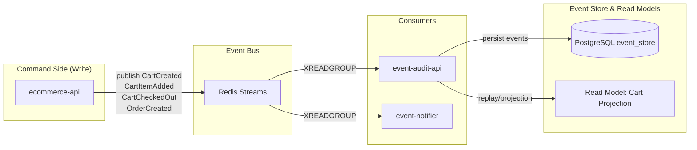
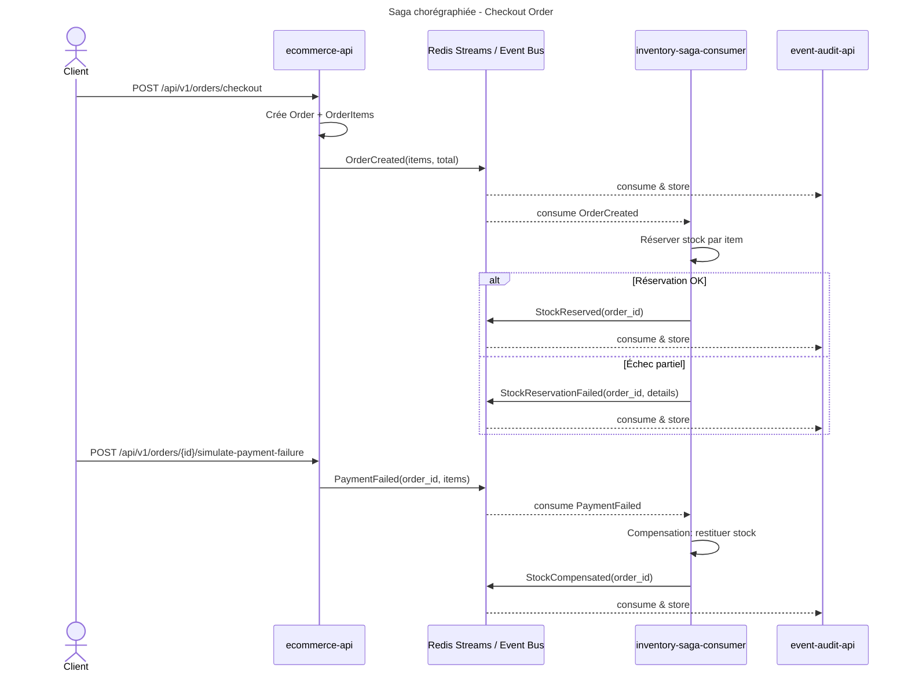

# Rapport – Architecture événementielle, CQRS et Saga chorégraphiée

## Scénario métier retenu
Panier e‑commerce (création de panier, ajout d’articles, checkout). À la création de commande (checkout), une saga chorégraphiée coordonne la réservation de stock et la compensation en cas d’échec du paiement.

## Schéma de l’architecture événementielle
- Producteurs: `ecommerce-api` publie sur Redis Streams (`ecommerce.carts.events`, `ecommerce.orders.events`, `ecommerce.payments.events`).
- Consommateurs: `event-audit-api` (Event Store + read models) et `inventory-saga-consumer` (réservation/compensation stock).
- Event Store: PostgreSQL (`event-store-db`).
- CQRS: Commandes côté `ecommerce-api`; requêtes via read models (`event-audit-api`).



*Figure : Schéma de l’architecture événementielle.* 

## Diagramme de séquence – Saga chorégraphiée



*Figure : Diagramme de séquence de la saga chorégraphiée (checkout et compensation).* 

## Explication de la saga chorégraphiée

- **Principe**: pas d’orchestrateur central. Chaque service réagit aux événements publiés sur le bus (`Redis Streams`). `ecommerce-api` émet les événements de domaine, `inventory-saga-consumer` applique les effets (réserver/restituer le stock) et publie les résultats, `event-audit-api` persiste tous les événements et alimente les read models (CQRS).

- **Flux nominal (succès)**:
  1. Le client demande le checkout.
  2. `ecommerce-api` crée la commande puis publie `OrderCreated` sur `ecommerce.orders.events`.
  3. `inventory-saga-consumer` consomme `OrderCreated`, réserve le stock par article, puis publie `StockReserved`.
  4. `event-audit-api` consomme et persiste tous les événements pour l’audit et la relecture; les read models sont mis à jour.

- **Flux d’échec et compensation**:
  - Si la réservation de stock échoue partiellement, `inventory-saga-consumer` publie `StockReservationFailed` et aucune modification durable n’est conservée côté stock.
  - Si le paiement échoue après réservation, `ecommerce-api` publie `PaymentFailed`; `inventory-saga-consumer` exécute la compensation (restitution des quantités) et publie `StockCompensated`.

- **Corrélation et idempotence**:
  - Les événements incluent un `order_id` (corrélation) et un `event_id` unique.
  - La consommation via `XREADGROUP` garantit un traitement « at-least-once ». Les handlers doivent être idempotents (déduplication par `event_id` côté `event-audit-api`, opérations stock idempotentes côté `inventory-saga-consumer`).

- **Garanties et cohérence**:
  - Livraison au moins une fois, ordre non strict entre streams différents.
  - Cohérence éventuelle: les projections/read models convergent après traitement.
  - Reprises sur erreur: relecture par groupe de consommateurs; les compensations ramènent le système à un état cohérent.

## ADR

### ADR-010 – Saga chorégraphiée pour le checkout e‑commerce

> Contexte: le checkout implique commande, stock, paiement; besoin d’atomicité logique distribuée et de résilience.
> Décision: saga chorégraphiée (basée événements), `inventory-saga-consumer` gère réservation/compensation.
> Alternatives: orchestrateur central; 2PC.
> Conséquences: + découplage/scalabilité; − traçage plus complexe (Event Store/observabilité requis).

### ADR-011 – Choix de Redis Streams comme bus d’événements

> Contexte: bus léger déjà présent, groupes de consommateurs, relecture.
> Décision: Redis Streams (XADD/XREADGROUP), idempotence simple, faible friction d’opération.
> Alternatives: Kafka, RabbitMQ.
> Conséquences: + simplicité; − moins adapté aux charges massives que Kafka.

## Extraits d’événements (succès, compensation)
— Événement de succès (réservation suite à OrderCreated):

```json
{
  "event_id": "stock-<ts>",
  "event_type": "StockReserved",
  "stream": "ecommerce.orders.events",
  "occurred_at": "2025-08-08T15:08:00Z",
  "aggregate_type": "Order",
  "aggregate_id": "3",
  "data": { "ok": true }
}
```

— Événement de compensation (échec paiement):

```json
{
  "event_id": "comp-<ts>",
  "event_type": "StockCompensated",
  "stream": "ecommerce.payments.events",
  "occurred_at": "2025-08-08T15:09:44Z",
  "aggregate_type": "Order",
  "aggregate_id": "3",
  "data": {}
}
```

— Événements panier (audit) persistés dans l’Event Store (exemple réel):

```json
{
  "id": 1,
  "event_id": "a2e05ef8-6e4b-4336-b880-9023b926ab81",
  "event_type": "CartItemAdded",
  "stream": "ecommerce.carts.events",
  "occurred_at": "2025-08-08T14:54:33.458513",
  "payload": {
    "event_id": "a2e05ef8-6e4b-4336-b880-9023b926ab81",
    "event_type": "CartItemAdded",
    "stream": "ecommerce.carts.events",
    "occurred_at": "2025-08-08T14:54:33.458513+00:00",
    "aggregate_type": "Cart",
    "aggregate_id": "1",
    "producer_instance": "ecommerce-api-1",
    "data": {"cart_item_id": 5, "product_id": 4, "quantity": 1, "unit_price": "699.99"}
  }
}
```

## Exemple de relecture (read model)
Reconstruction du panier 1 via `event-audit-api`:

```json
{
  "cart_id": "1",
  "customer_id": null,
  "session_id": null,
  "items": [
    {"cart_item_id": 5, "product_id": 4, "quantity": 1, "unit_price": 699.99}
  ],
  "total_items": 1,
  "total_amount": 699.99
}
```

## Extraits de logs significatifs (saga)

```text
HTTP PUT inventory-api ... /stock/products/2/stock/reduce ... 200 OK
HTTP PUT inventory-api ... /stock/products/1/stock/reduce ... 200 OK
HTTP PUT inventory-api ... /stock/products/4/stock/reduce ... 200 OK
-- Paiement échoué simulé --
HTTP PUT inventory-api ... /stock/products/2/stock/increase ... 200 OK
HTTP PUT inventory-api ... /stock/products/1/stock/increase ... 200 OK
HTTP PUT inventory-api ... /stock/products/4/stock/increase ... 200 OK
```


