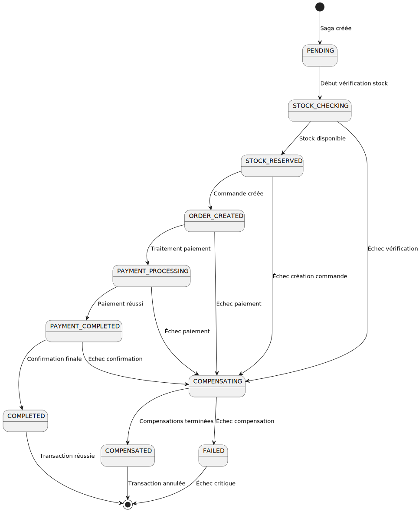
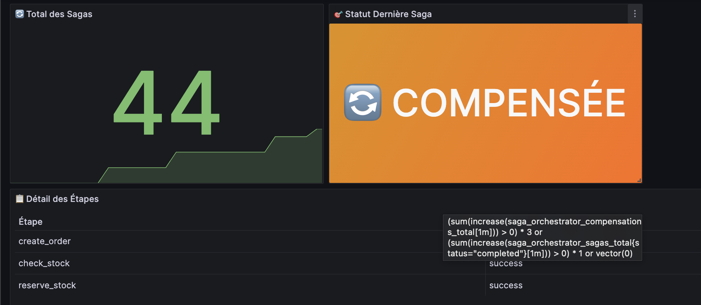

# Rapport d'Implémentation - Saga Orchestrée pour le Traitement de Commandes

## 1. Scénario Métier et Saga Implémentée

### 1.1 Contexte Métier

Dans un environnement de microservices e-commerce, le traitement d'une commande implique plusieurs services indépendants qui doivent collaborer de manière coordonnée. Le défi principal est de maintenir la cohérence des données lorsqu'une transaction échoue partiellement, nécessitant l'annulation des opérations déjà effectuées.

### 1.2 Scénario de Traitement de Commande

Le processus de traitement de commande suit les étapes suivantes :

1. **Vérification du Stock** : Vérifier la disponibilité des produits dans l'inventaire
2. **Réservation du Stock** : Réduire temporairement le stock disponible  
3. **Création de Commande** : Créer l'enregistrement de commande dans le système e-commerce
4. **Traitement du Paiement** : Processor le paiement client
5. **Confirmation** : Finaliser la commande et confirmer la transaction

### 1.2.1 Exemple de Saga Réussie

**Scénario** : Traitement d'une commande avec customer existant et stock disponible

Toutes les étapes se déroulent avec succès :
1. `CHECK_STOCK` → Produits disponibles
2. `RESERVE_STOCK` → Stock réservé
3. `CREATE_ORDER` → Commande créée
4. `PROCESS_PAYMENT` → Paiement traité
5. `CONFIRM_ORDER` → Commande confirmée

**Résultat** : État final `COMPLETED`, transaction réussie

*Figure 1 : Dashboard montrant une saga complétée avec succès - toutes les étapes sont passées et l'état final est COMPLETED*

### 1.3 Architecture de la Saga Implémentée

Notre implémentation utilise le **pattern Saga Orchestrée** avec les caractéristiques suivantes :

- **Orchestrateur Central** : Service `saga-orchestrator-api` qui coordonne l'ensemble du processus
- **Exécution Synchrone** : Chaque étape est exécutée séquentiellement et attend la réponse avant de passer à la suivante
- **Gestion d'État Persistante** : L'état de chaque saga est stocké en base de données PostgreSQL
- **Compensation Automatique** : En cas d'échec, les actions déjà effectuées sont automatiquement annulées

**Services Impliqués :**
- `inventory-api` : Gestion du stock et des produits
- `ecommerce-api` : Gestion des commandes et clients  
- `saga-orchestrator-api` : Orchestration des transactions distribuées

## 2. Diagramme de la Machine d'État

### 2.1 États de la Saga

- **PENDING** : Saga créée, en attente d'exécution
- **STOCK_CHECKING** : Vérification de la disponibilité du stock
- **STOCK_RESERVED** : Stock réservé avec succès
- **ORDER_CREATED** : Commande créée dans le système
- **PAYMENT_PROCESSING** : Traitement du paiement en cours
- **PAYMENT_COMPLETED** : Paiement traité avec succès
- **COMPLETED** : Saga terminée avec succès
- **COMPENSATING** : Exécution des compensations en cours
- **COMPENSATED** : Compensations terminées, transaction annulée
- **FAILED** : Échec critique de la saga

## 3. Décisions d'Architecture (ADR)

### ADR-007 : Adoption du Pattern Saga Orchestrée

**Status** : Accepté

**Context** : 
Dans un environnement de microservices, nous devons maintenir la cohérence des transactions qui impliquent plusieurs services. Les transactions ACID traditionnelles ne sont pas applicables dans un contexte distribué.

**Decision** : 
Nous adoptons le pattern Saga Orchestrée plutôt que Saga Chorégraphiée pour les raisons suivantes :

- **Contrôle centralisé** : Un orchestrateur central facilite le monitoring et le debugging
- **Visibilité** : État global visible et traçable
- **Gestion d'erreurs simplifiée** : Logique de compensation centralisée
- **Évolutivité** : Facilité d'ajout de nouvelles étapes

**Consequences** :
-  Meilleure traçabilité des transactions
-  Gestion centralisée des erreurs et compensations
-  Facilité de monitoring et observabilité
-  Point de défaillance unique (orchestrateur)
-  Couplage plus fort entre services

### ADR-008 : Gestion des Customer ID dans les URLs

**Status** : Accepté

**Context** :
L'API initiale créait automatiquement des customers quand l'ID fourni n'existait pas, ce qui ne correspond pas au comportement attendu d'un système de production.

**Decision** :
Nous modifions l'API pour :

1. **Validation stricte des Customer ID** : Vérifier l'existence du customer avant de procéder
2. **Endpoint RESTful** : `/customers/{customer_id}/order-processing` au lieu de `/order-processing`
3. **Échec explicite** : Retourner une erreur si le customer n'existe pas

**Implementation** :
La vérification stricte du customer est implémentée via un appel GET à l'API ecommerce pour valider l'existence du customer avant de procéder à la création de la commande.

**Consequences** :
-  Comportement prévisible et cohérent
-  API RESTful conforme aux standards
-  Validation métier appropriée
-  Nécessite la création préalable des customers

## 4. Mécanismes de Compensation

### 4.1 Principe de Compensation

Le système implémente des **actions de compensation** pour chaque étape qui modifie l'état du système. Ces compensations sont exécutées dans l'**ordre inverse** des étapes originales.

### 4.2 Mapping Étapes ↔ Compensations

| Étape Originale | Action de Compensation | Description |
|----------------|----------------------|-------------|
| `CHECK_STOCK` | Aucune | Lecture seule, pas de compensation nécessaire |
| `RESERVE_STOCK` | `RELEASE_STOCK` | Remettre les quantités dans le stock disponible |
| `CREATE_ORDER` | `CANCEL_ORDER` | Annuler la commande créée |
| `PROCESS_PAYMENT` | `REFUND_PAYMENT` | Rembourser le montant prélevé |
| `CONFIRM_ORDER` | Aucune | Étape finale, pas de compensation |

### 4.3 Implémentation des Compensations

#### 4.3.1 Libération du Stock (`RELEASE_STOCK`)

Cette compensation remet les quantités précédemment réservées dans le stock disponible. Pour chaque produit de la commande, une requête PUT est envoyée à l'API inventory pour augmenter le stock avec la quantité correspondante et tracer l'opération de compensation.

#### 4.3.2 Annulation de Commande (`CANCEL_ORDER`)

Cette compensation annule la commande créée en envoyant une requête POST à l'endpoint d'annulation de l'API ecommerce avec l'ID de la commande précédemment créée.

#### 4.3.3 Remboursement (`REFUND_PAYMENT`)

Cette compensation effectue le remboursement du montant prélevé. Dans l'implémentation actuelle, le remboursement est simulé avec un logging approprié incluant l'ID du paiement et le montant à rembourser.

### 4.4 Ordre d'Exécution des Compensations

Les compensations sont exécutées dans l'**ordre inverse** des étapes réussies :

Le processus de compensation itère sur les étapes exécutées avec succès dans l'ordre inverse, détermine l'action de compensation appropriée pour chaque étape, l'exécute, et enregistre les métriques correspondantes. L'état de la saga est mis à jour vers `COMPENSATING` au début du processus et `COMPENSATED` à la fin.

### 4.5 Exemple de Scénario de Compensation

**Scénario** : Customer inexistant (ID 99999)

1. `CHECK_STOCK` → Réussit
2. `RESERVE_STOCK` → Réussit (stock réduit)
3. `CREATE_ORDER` → Échoue (customer inexistant)

**Compensations exécutées** :
1. `RELEASE_STOCK` → Remet le stock réservé en disponible

**Résultat** : État final `COMPENSATED`, système cohérent

*Figure 2 : Dashboard montrant une saga compensée - les étapes réussies (CHECK_STOCK, RESERVE_STOCK) ont été suivies d'une compensation (RELEASE_STOCK) suite à l'échec de CREATE_ORDER*

## 5. Observabilité et Monitoring

### 5.1 Métriques Prometheus

Le système expose des métriques détaillées pour le monitoring :

- **Compteurs de Sagas** : `saga_orchestrator_sagas_total{status="completed|failed"}`
- **Compteurs de Compensations** : `saga_orchestrator_compensations_total`
- **Durée des Sagas** : `saga_orchestrator_saga_duration_seconds`
- **Étapes Détaillées** : `saga_orchestrator_saga_steps_total{step, status}`

### 5.2 Dashboard Grafana

Un dashboard de monitoring affiche :
- **Total des Sagas** exécutées
- **Statut de la Dernière Saga** (Complété/Compensé)
- **Détail des Étapes** avec statuts individuels

### 5.3 Logging Structuré

Chaque saga génère des logs détaillés avec :
- ID unique de saga
- Timestamps précis
- Durées d'exécution
- Contexte métier complet

## 6. Avantages et Limitations

### 6.1 Avantages

- **Cohérence Éventuelle** : Garantit la cohérence des données distribuées
- **Résilience** : Gestion automatique des pannes partielles
- **Traçabilité** : Historique complet des transactions
- **Observabilité** : Monitoring en temps réel
- **Évolutivité** : Facilité d'ajout de nouvelles étapes

### 6.2 Limitations

- **Complexité** : Plus complexe qu'une transaction simple
- **Performance** : Overhead lié à la coordination
- **Point de Défaillance** : Dépendance à l'orchestrateur
- **Cohérence Temporaire** : États intermédiaires inconsistants

## 7. Conclusion

L'implémentation de la saga orchestrée fournit une solution  pour la gestion des transactions distribuées dans notre architecture microservices. Le système maintient la cohérence des données tout en offrant une excellente observabilité et une gestion d'erreurs.

L'approche centralisée facilite le debugging et le monitoring, tandis que les mécanismes de compensation automatique garantissent l'intégrité des données en cas d'échec partiel. 